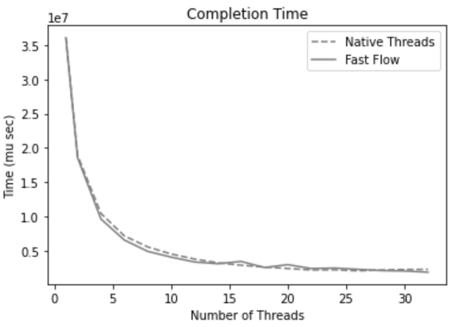
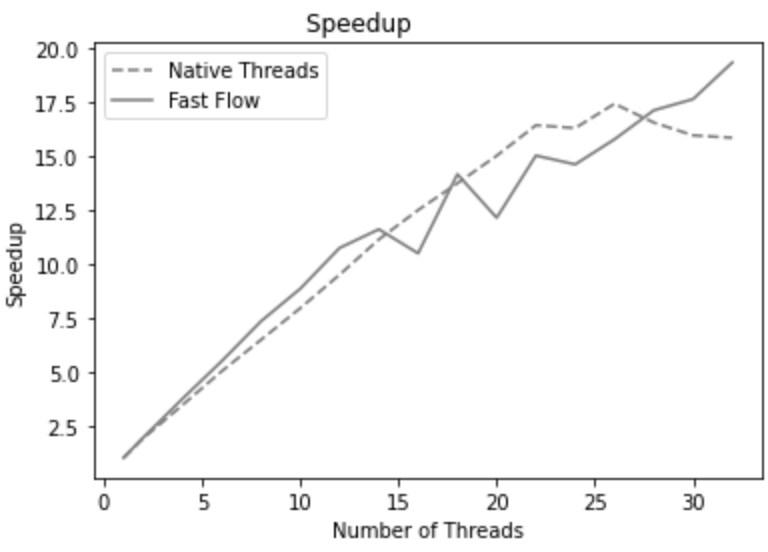

# Parallel Jacobi

A comparison between different parallel implementations of the Jacobi algorithm for determining the solutions of a system of linear equations.

## Table of contents[](#table-of-contents)
1. [Implementation](#implementation)
2. [Structure](#structure)
3. [Compiling](#compiling)
4. [Running](#running)
5. [Results](#results)

## Implementation

The parallel versions of this algorithm that have been implemented are:

1. The matrix is divided by chunks of continuous rows, each chunk is assigned to a worker.
2. Parallel implementation using FastFlow library.

A sequential version of the program has also been implemented to perform comparisons.

## Structure

```
📦JacobiSPM
 ┣ 📂plot
 ┃ ┣ ...
 ┣ 📂src
 ┃ ┣ 📜CMakeLists.txt
 ┃ ┣ 📜Makefile
 ┃ ┣ 📜bash.sh
 ┃ ┣ 📜jacobi_ff.cpp
 ┃ ┣ 📜jacobi_ff.h
 ┃ ┣ 📜jacobi_sequential.cpp
 ┃ ┣ 📜jacobi_sequential.h
 ┃ ┣ 📜jacobi_threads.cpp
 ┃ ┣ 📜jacobi_threads.h
 ┃ ┣ 📜main.cpp
 ┃ ┣ 📜normcomputation.cpp
 ┃ ┣ 📜overhead.cpp
 ┃ ┣ 📜utility.cpp
 ┃ ┣ 📜utility.h
 ┃ ┣ 📜utimer.cpp
 ┃ ┣ 📜vectorization.cpp
 ┣ 📜README.md                     
```

## Compiling

A Makefile was created to compile the various versions. To create the executable files, it is possible to execute the rule

```bash
    make
```

## Running

To run an experiment, it is possible to launch the program and pass the necessary arguments. An example is the following

```bash
    ./main.out [mode] [matrix_size] [number_iterations] [tolerance] [output_filename] [num_threads]
``` 

where
- **[mode]**: is the modality to execute the algorithm 
- - **[seq]**: sequential version
- - **[thr]**: native threads version
- - **[ff]**: FastFlow version
- **[matrix_size]**: is the length of the matrix and vector. A matrix of size matrix_size*matrix_size and a vector of length matrix_size will be created.
- **[number_iterations]**: Number of iterations to be performed for Jacobi's method.
- **[tolerance]**: is the stopping criteria in order to avoid to reach the maximum number of iterations.
- **[output_filename]: is the filename where the outputs will be saved (it is a csv file)
- **[num_threads]**: Degree of parallelism to be used.

To run all experiments at once run the file execute.sh

```bash
    ./bash.sh
``` 

## Results

Below are some results for completion time and speedup with matrixes of size $15.000 \times 15.000$

<p align="center">


</p>
